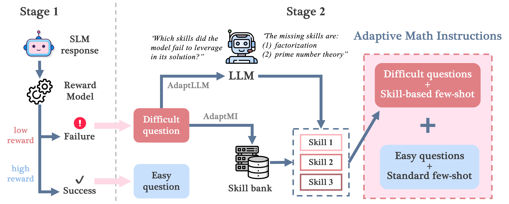

# **AdaptMI : Adaptive Skill-based In-context Math Instructions for Small Language Models**

This is the homepage of the paper **AdaptMI : Adaptive Skill-based In-context Math Instructions for Small Language Models.**

Our work compares the in-context learning of SLM (Small Language Models) with human learning from teachers in a classroom. Instead of feeding in a fixed set of in-context examples, we propose an AdaptMI, an **Adapt**ive approach to selecting skill-based in-context **M**ath **I**nstructions for SLMs.

Inspired by cognitive load theory from human pedagogy, our method only introduces skill-based examples when the model performs poorly. Our method effectively boost the math reasoning accuracy of SLM by up to 6% over naive skill-based prompting strategies.



### Stage1: **Detection of *easy* and *difficult* questions**

In this stage, we will label a question as *easy* or *difficult* for a Small Language Model.

`math-rm/rm_classify.py` employs a process reward model to assign scores for each step in the SLM response. We then use thresholds τ1, τ2 (`pred_thres1` and `pred_thres2` in the code) to classify whether a question q is easy or difficult.

### **Stage 2: Skill-based selection of in-context examples**

- AdaptMI uses skill-based *k*-shot examples for *difficult* questions and fixed *k*-shot examples for *easy* questions.
- AdaptMI+ focuses only on the skills that the model’s initial response lacks.

## Environmental Setup

```json
conda create -n matheval python=3.10
conda activate matheval

cd evaluation/latex2sympy
pip install -e .
cd ..
pip install -r requirements.txt 
pip install vllm==0.5.1 --no-build-isolation
pip install transformers==4.42.3
```

```json
conda create -n stage1 python=3.10.9
conda activate stage1

git clone https://github.com/OpenAccess-AI-Collective/axolotl
cd axolotl
git checkout 55cc214c767741e83ee7b346e5e13e6c03b7b9fa
pip install -e .

pip3 install torch==2.1.2 torchvision torchaudio
pip install flash-attn

git clone https://github.com/lm-sys/FastChat.git
cd FastChat
pip install -e .

git clone https://github.com/WeiXiongUST/RLHF-Reward-Modeling.git
pip install deepspeed

pip install -r math-rm/requirements.txt
```

```json
conda create -n stage2+ python=3.10
conda activate stage2+
pip install skill_identifier/requirements.txt
```

## AdaptMI

```json
sh scripts/adaptmi.sh
```

## AdaptMI+

```json
sh scripts/adaptmi+.sh
```

# Citation

```json
@article{he2025adaptmi,
  title={AdaptMI: Adaptive Skill-based In-context Math Instruction for Small Language Models},
  author={He, Yinghui and Panigrahi, Abhishek and Lin, Yong and Arora, Sanjeev},
  journal={arXiv preprint arXiv:2505.00147},
  year={2025}
}
```